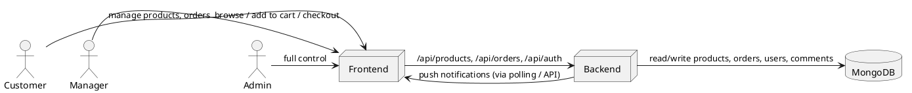
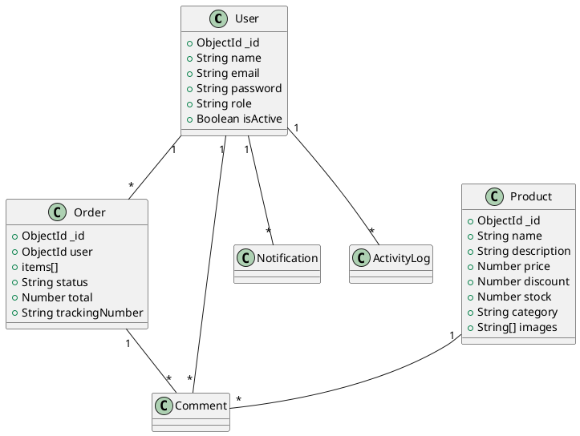

# Tana Market — Project Documentation

Generated: 2026-01-22

---

## Table of Contents

- Project Summary
- Features
- Architecture Overview
- Data Models (MongoDB / Mongoose)
- API Endpoints (summary)
- Frontend Structure
- Security & Auth
- Payments (Chapa)
- Order Tracking & Business Logic
- UML & Diagrams (PlantUML)
- Screenshots (placeholders and instructions)
- Deployment & Run Instructions
- Testing
- Appendix A — Important Source Files
- Appendix B — Full File List

---

## Project Summary

Tana Market is a full-stack e-commerce platform built with Node.js/Express (backend), MongoDB (database), and React + Vite (frontend). It supports three roles: `admin`, `manager`, and `customer` and includes product management, order lifecycle, payment integration (Chapa), tracking numbers, notifications, and activity logging.

Source repository: workspace root.

## Features

- Role-based access control (RBAC): `admin`, `manager`, `customer`
- Product management (CRUD, images, categories)
- Shopping cart, checkout, order creation, return/refund flow
- Payment integration with Chapa (webhook handling)
- Unique tracking number generation: `TANA-YYYYMMDD-XXXX`
- Notifications, activity logs, reports
- Responsive React frontend with Admin/Manager/Customer layouts

## Architecture Overview

- Backend: `backend/` — Express server (`server.js`), Mongoose models in `backend/models/`, routes in `backend/routes/`, middleware in `backend/middleware/`.
- Frontend: `frontend/` — React + Vite app. Entry point `src/main.jsx`, main app `src/App.jsx`.
- Persistence: MongoDB, models implement schemas and indexes.
- Notifications: stored in `Notification` model, created via `backend/utils/notifications.js`.

High-level architecture (PlantUML):



## Data Models (summary)

Below are the primary Mongoose models used in the backend; full definitions are included in Appendix A.

- `User` — fields: `name`, `email`, `password` (hashed), `role` (customer|manager|admin), `isActive`.
- `Product` — `name`, `description`, `price`, `discount`, `stock`, `category`, `images`, `rating`, `reviewCount`, `isActive`.
- `Order` — `user` (ref), `items` (product, quantity, price), `shippingAddress`, `status`, `total`, `trackingNumber`, `paymentReference`, returnRequest structure, `estimatedDeliveryTime` and auto-complete helper logic.
- `Comment` — `user`, `product`, `order`, `rating`, `comment`, `status` (pending/approved/rejected), unique index on `(user, product)`.
- `Notification` — `user`, `type`, `title`, `message`, `link`, `read`, `metadata`.
- `ActivityLog` — `user`, `action`, `description`, `metadata`.

### Order tracking and unique tracking number

Orders generate unique `trackingNumber` when status becomes `paid`. Format is `TANA-YYYYMMDD-XXXX`. Generation uses counting and retry logic to avoid collisions; a unique partial index on `trackingNumber` is defined.

## API Endpoints (summary)

Key routes (see `backend/routes/`):

- `POST /api/auth/register` — register new customer
- `POST /api/auth/login` — login and return JWT
- `GET /api/products` — list products (query params: `category`, `search`, `limit`)
- `GET /api/products/:id` — product detail
- `POST /api/products` — create product (manager/admin, file upload)
- `PUT /api/products/:id` — update product
- `DELETE /api/products/:id` — delete product
- `POST /api/orders` — create order (authenticated)
- `GET /api/orders` — fetch user orders (authenticated)
- `GET /api/orders/tracking/:trackingNumber` — fetch order by tracking number
- `POST /api/payments/verify` — webhook endpoint (raw body) for Chapa verification

Authentication middleware: `authenticate` checks JWT and `authorize(...roles)` enforces RBAC.

## Frontend Structure

- Entry: `src/main.jsx`
- Main router and protected routes: `src/App.jsx`
- Layouts: `src/layouts/*` — `AdminLayout`, `ManagerLayout`, `CustomerLayout`, `AuthLayout`
- Pages: `src/pages/*` — organized by role and function (customer, admin, manager, auth)
- Components: `src/components/*` — UI primitives and layout components
- Store: `src/store/*` — small local state stores for auth, cart, notifications
- API helper: `src/utils/api.js` (axios instance, request/response interceptors)

## Security & Auth

- JWT-based auth. Token signed with `process.env.JWT_SECRET`.
- Password hashing with `bcryptjs` in the `User` model `pre('save')` hook.
- `authenticate` middleware validates token and loads user (excluding password).
- `authorize(...)` middleware checks user role.

## Payments (Chapa)

- The server exposes `/api/payments/verify` which accepts a raw JSON body for secure verification of webhooks.
- Payment verification updates order status and triggers notifications.

## Order Lifecycle & Business Logic

Typical flow: `pending -> paid -> approved -> shipped -> delivered` (or `cancelled`).

- Tracking numbers are assigned on `paid` state via `Order` pre-save hook with retry generation.
- Auto-delivery: `order.autoMarkDeliveredIfDue()` checks `estimatedDeliveryTime` (minutes) and marks delivered if time passed; triggers notifications.

## UML & Diagrams (PlantUML)

Below are PlantUML sources you can render with PlantUML or an online renderer to produce class and sequence diagrams.

### Class diagram (models)



### Sequence diagram: checkout and payment

```plantuml
@startuml
actor Customer
participant Frontend
participant Backend
database MongoDB

Customer -> Frontend: complete checkout
Frontend -> Backend: POST /api/orders
Backend -> MongoDB: create Order (status=pending)
Frontend -> PaymentGateway(Chapa): init payment
PaymentGateway -> Backend: webhook /api/payments/verify
Backend -> MongoDB: set order.status = paid, generate trackingNumber
Backend -> Frontend: notification / createNotification
@enduml
```

## Screenshots

This repository contains `frontend/public/logo.png` and other assets. I cannot capture runtime screenshots here. To include screenshots in the Word/PDF deliverable, run the app locally and capture the following pages:

- Home page (`/`)
- Product detail (`/products/:id`)
- Checkout page (`/checkout`)
- Admin dashboard (`/admin/dashboard`)

Place screenshots in `docs/screenshots/` and reference them in the markdown like ``.

## Deployment & Run Instructions

Prerequisites: Node.js (v18+ recommended), npm, MongoDB (local or Atlas).

Install all dependencies:

```bash
npm run install:all
```

Run development (frontend + backend concurrently):

```bash
npm run dev
```

Backend default port: `5001`. Frontend Vite dev server runs on `5173` by default and proxies `/api` to the backend.

Environment variables (create `.env` in `backend/`):

- `MONGODB_URI` — MongoDB connection string
- `JWT_SECRET` — JWT signing secret
- `CHAPA_API_KEY` — Chapa API key (if required by integration)

## Testing & Validation

- Unit/integration tests: not present in repo. Consider adding tests for critical modules (order flow, payment verification, auth).
- Manual testing checklist:
  - Register + login flows
  - Product CRUD by manager/admin
  - Create order + payment simulation
  - Webhook handling for payment verification
  - Tracking number uniqueness under concurrency

## Appendix A — Important Source Files (selected, full definitions)

### `backend/server.js`

```javascript
import express from 'express'
import mongoose from 'mongoose'
import cors from 'cors'
import dotenv from 'dotenv'
import path from 'path'
import { fileURLToPath } from 'url'
import Product from './models/Product.js'
import Order from './models/Order.js'

const __filename = fileURLToPath(import.meta.url)
const __dirname = path.dirname(__filename)

dotenv.config()

const app = express()

// Middleware
app.use(cors())
app.use(express.json())
app.use(express.urlencoded({ extended: true }))
app.use('/uploads', express.static(path.join(__dirname, 'uploads')))

// Webhook endpoint needs raw body for Chapa verification
app.use('/api/payments/verify', express.raw({ type: 'application/json' }))

// Routes
import authRoutes from './routes/auth.js'
import productRoutes from './routes/products.js'
import orderRoutes from './routes/orders.js'
import paymentRoutes from './routes/payments.js'
import userRoutes from './routes/users.js'
import commentRoutes from './routes/comments.js'
import adminRoutes from './routes/admin.js'
import managerRoutes from './routes/manager.js'
import notificationRoutes from './routes/notifications.js'

app.use('/api/auth', authRoutes)
app.use('/api/products', productRoutes)
app.use('/api/orders', orderRoutes)
app.use('/api/payments', paymentRoutes)
app.use('/api/users', userRoutes)
app.use('/api/comments', commentRoutes)
app.use('/api/admin', adminRoutes)
app.use('/api/manager', managerRoutes)
app.use('/api/notifications', notificationRoutes)

// Public stats endpoint used on customer home page (read-only aggregate data)
app.get('/api/stats', async (req, res) => {
  try {
    const [totalProducts, totalOrders, uniqueCustomerIds] = await Promise.all([
      Product.countDocuments(),
      Order.countDocuments({
        status: { $in: ['paid', 'approved', 'shipped', 'delivered'] },
      }),
      Order.distinct('user', {
        status: { $in: ['paid', 'approved', 'shipped', 'delivered'] },
      }),
    ])

    res.json({
      totalProducts,
      totalOrders,
      happyCustomers: uniqueCustomerIds.length,
    })
  } catch (error) {
    console.error('Error fetching stats:', error)
    res.status(500).json({ message: 'Error fetching stats' })
  }
})

// Connect to MongoDB
const connectDB = async () => {
  try {
    await mongoose.connect(process.env.MONGODB_URI || 'mongodb://localhost:27017/tana-mmarket')
    console.log('MongoDB connected')
  } catch (error) {
    console.error('MongoDB connection error:', error)
    process.exit(1)
  }
}

connectDB()

const PORT = process.env.PORT || 5001
app.listen(PORT, () => {
  console.log(`Server running on port ${PORT}`)
})

```

### `backend/middleware/auth.js`

```javascript
import jwt from 'jsonwebtoken'
import User from '../models/User.js'

export const authenticate = async (req, res, next) => {
  try {
    const token = req.headers.authorization?.replace('Bearer ', '')
    
    if (!token) {
      return res.status(401).json({ message: 'Authentication required' })
    }
    
    const decoded = jwt.verify(token, process.env.JWT_SECRET || 'your-secret-key')
    const user = await User.findById(decoded.userId).select('-password')
    
    if (!user || !user.isActive) {
      return res.status(401).json({ message: 'Invalid or inactive user' })
    }
    
    req.user = user
    next()
  } catch (error) {
    res.status(401).json({ message: 'Invalid token' })
  }
}

export const authorize = (...roles) => {
  return (req, res, next) => {
    if (!req.user) {
      return res.status(401).json({ message: 'Authentication required' })
    }
    
    if (!roles.includes(req.user.role)) {
      return res.status(403).json({ message: 'Access denied' })
    }
    
    next()
  }
}
```

### `frontend/src/App.jsx` (excerpt)

```jsx
// See full file in repository
import { BrowserRouter as Router, Routes, Route, Navigate } from 'react-router-dom'
import { Toaster } from 'react-hot-toast'
import useAuthStore from './store/authStore'
// ... layouts and pages omitted for brevity

function App() {
  return (
    <Router>
      <Toaster />
      <Routes>
        {/* public, protected, manager, admin routes */}
      </Routes>
    </Router>
  )
}

export default App
```

## Appendix B — Full File List

Below is the repository file tree (selected):

- ADMIN_GUIDE.md
- CHAPA_SETUP.md
- README.md
- backend/
  - server.js
  - package.json
  - models/
    - Product.js
    - Order.js
    - User.js
    - Comment.js
    - Notification.js
    - ActivityLog.js
  - routes/
    - auth.js
    - products.js
    - orders.js
    - payments.js
    - users.js
    - comments.js
    - admin.js
    - manager.js
    - notifications.js
  - middleware/
    - auth.js
  - utils/
    - notifications.js
- frontend/
  - package.json
  - src/
    - main.jsx
    - App.jsx
    - components/
    - pages/
    - layouts/
    - store/
    - utils/

---

## Converting to Word (`PROJECT_DOCUMENTATION.docx`)

I will attempt to convert this markdown to a Word document using `pandoc` if available in this environment. If `pandoc` is not installed, run locally:

```bash
pandoc PROJECT_DOCUMENTATION.md -o PROJECT_DOCUMENTATION.docx --from markdown+yaml_metadata_block+raw_attribute
```

For rendering PlantUML diagrams into images before conversion, run PlantUML to produce PNGs and reference them in the markdown.

---

End of generated documentation.
